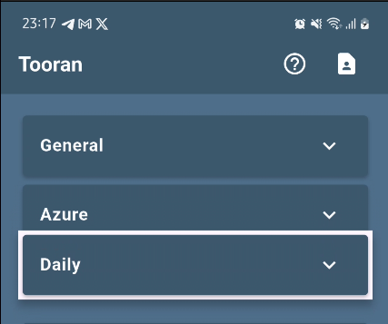

# Tooran

Tooran is a Flutter-based To-Do list application that lets you manage your tasks using categories. The app supports drag-and-drop reordering for both categories and tasks, making it easy to organize your workflow. Data persistence is handled via `shared_preferences`, ensuring your tasks and categories are saved between app sessions.

## Features

- **Category Management**
  - Create, edit, and delete categories.
  
  - Drag-and-drop reordering of categories.

- **Task Management**
  - Add tasks within each category.
   
  - Mark tasks as complete or incomplete.
  
  - Edit and delete tasks.
  
  
  - Drag-and-drop reordering of tasks within each category.
  

- **Data Persistence**
  - Uses the `shared_preferences` package to save and load your categories and tasks.

- **User Interface**
  - Responsive and intuitive design using Flutter's widgets like `ExpansionTile` and `ReorderableListView`.

## Contributing

Contributions are welcome! If you have any ideas for improvements or bug fixes, please open an issue or submit a pull request.