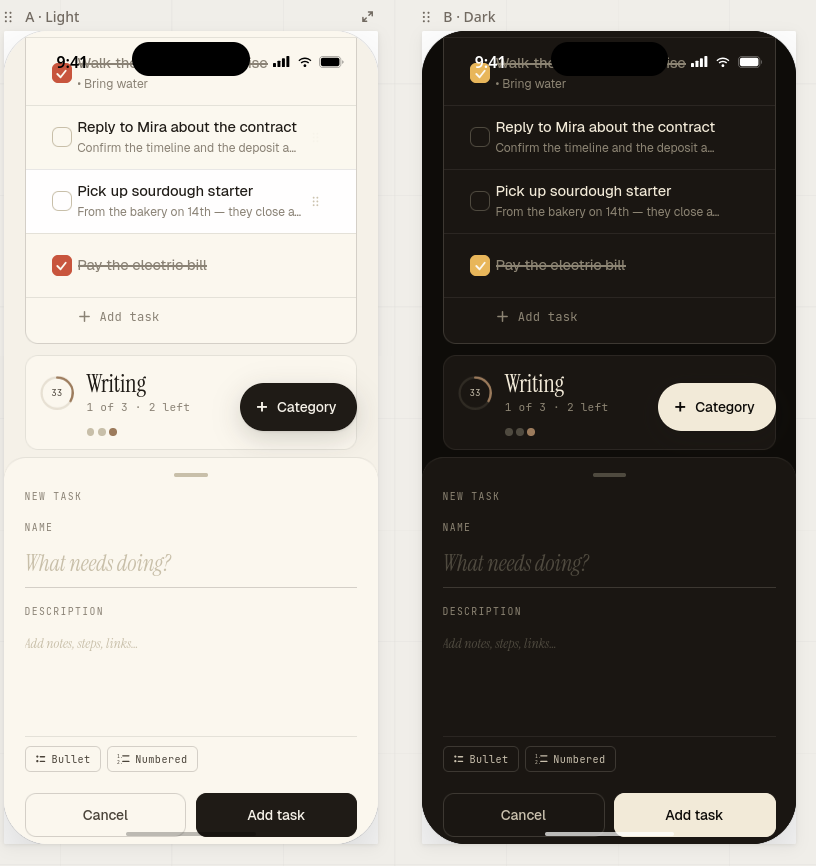
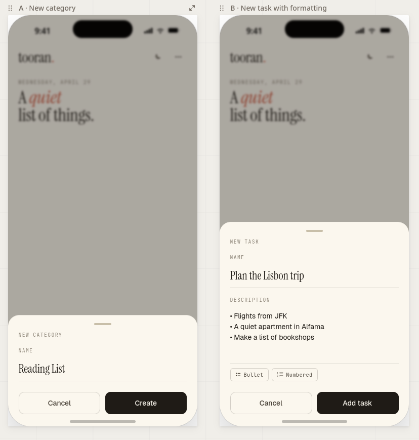
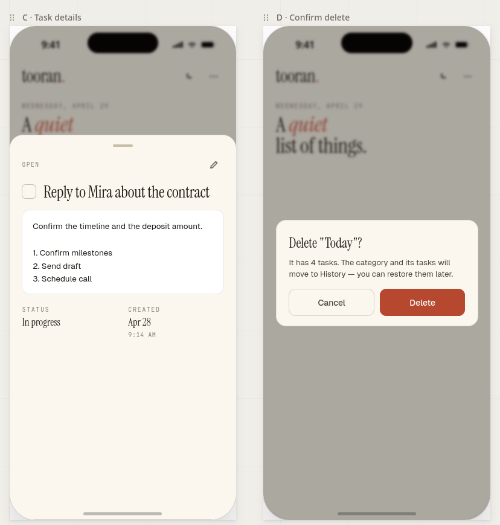

# Tooran Task Manager - Developer Documentation

Tooran is a Flutter-based To-Do list application that lets you manage your tasks using categories. The app supports drag-and-drop reordering for both categories and tasks, making it easy to organize your workflow. Data persistence is handled via `shared_preferences`, ensuring your tasks and categories are saved between app sessions.

### **See Releases**
[See the Demo here](https://www.youtube.com/watch?v=kX6OZsZcpO4)

download the app from [tooran website](https://tooran.vercel.app)