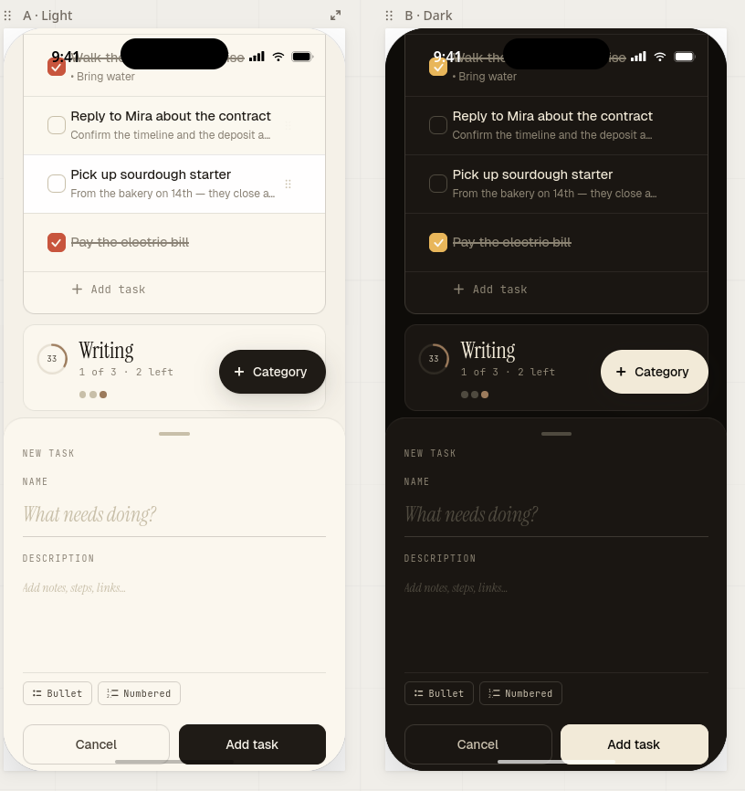
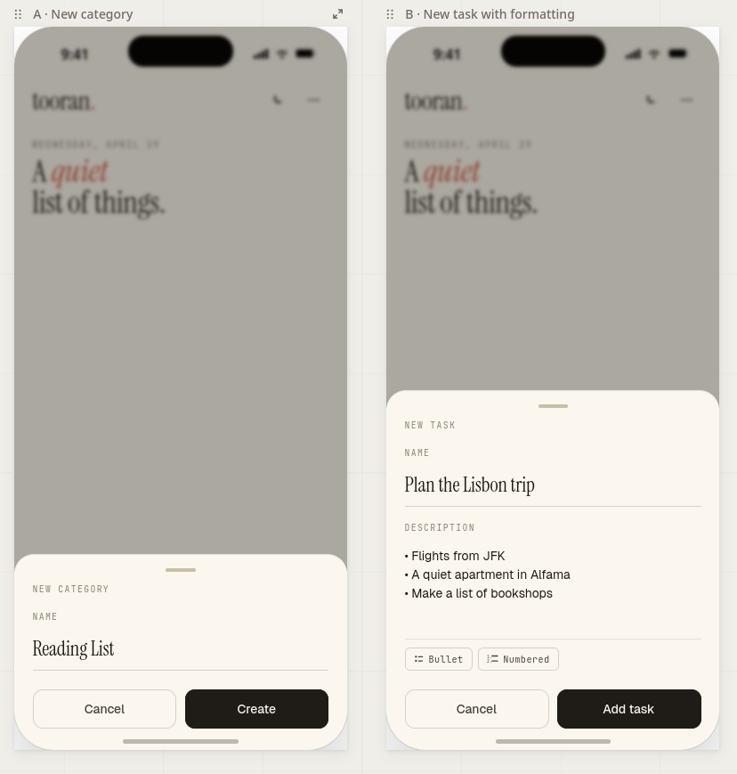
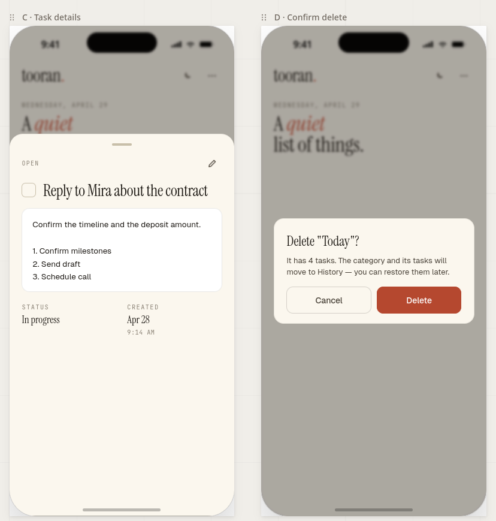

# Tooran

A calm, local-first organizer: to-do lists with checklists and Markdown notes,
money (who owes whom), spending with budgets, bills, savings goals and notes.
Everything stays on your device. Available in English, Amharic and Afaan Oromoo.

[Demo video](https://www.youtube.com/watch?v=kX6OZsZcpO4) ·
[Download](https://tooran.vercel.app) ·
[Releases](https://github.com/JiruGutema/Tooran/releases)





---

## Develop

### 1. Install the tools (no Android Studio needed)

| Tool | Where it lives here |
| --- | --- |
| Flutter (stable) | `~/development/flutter` |
| JDK 17 | `~/development/jdk-17` |
| Android SDK (cmdline-tools, platform-tools, platform 36) | `~/Android/Sdk` |

`~/.bashrc` puts them on `PATH` and sets `JAVA_HOME` / `ANDROID_HOME`. On a new
machine: install those three, accept licenses with
`flutter doctor --android-licenses`, and run `make doctor`.

The Linux desktop build additionally needs
`sudo apt install clang cmake ninja-build pkg-config libgtk-3-dev`.

### 2. Everyday commands

```bash
make setup        # flutter pub get + generate translations
make run          # run on the connected phone (USB or wireless debugging)
make run-linux    # run the desktop app
make check        # flutter analyze + all tests
make apk-debug    # debug APK → build/app/outputs/flutter-apk/app-debug.apk
make help         # everything else
```

Debug builds install as **Tooran Dev** (`io.github.jirugutema.tooran.debug`),
next to the real app, so testing never touches your real data.

### 3. Project map

| Where | What |
| --- | --- |
| `lib/providers/` | app state: categories/tasks, settings, theme |
| `lib/services/` | storage (SQLite), backup, reminders, home widget, share-in |
| `lib/models/` | Category, Task, Payment |
| `lib/utils/` | Markdown/checklists, money, spending stats, dates, calendars |
| `lib/pages/`, `lib/widgets/` | screens and UI pieces (mobile + desktop) |
| `lib/l10n/app_{en,am,om}.arb` | translations (run `make l10n` after editing) |
| `lib/theme/app_theme.dart` | the color themes |
| `android/` | widget, share intent, notifications, signing |
| `docs/` | plans, phone test checklist, release notes |
| `packaging/` | Linux `.deb` packaging |

---

## Publish a release

Releases are Android APKs (GitHub / website), an App Bundle (Google Play) and
a Linux `.deb`. `make release` builds all of them into `dist/`.

### 1. Signing key (once)

Android only accepts an update if it is signed with **the same key** as the
installed version.

- **You already have the key from earlier releases:** create
  `android/key.properties` pointing at it:
  ```properties
  storePassword=…
  keyPassword=…
  keyAlias=…
  storeFile=/absolute/path/to/your-key.jks
  ```
- **Starting fresh:** `make keystore` creates `~/.android-keys/tooran-upload.jks`
  and `android/key.properties`. People who installed an older Tooran signed
  with a different key must uninstall it before installing this one (their
  data should be exported first).

Back up the `.jks` file and its password somewhere safe (password manager +
offline copy). Both files are git-ignored — never commit them.

Without `key.properties`, release targets stop; `ALLOW_DEBUG_SIGNING=1 make
apk` builds a debug-signed APK for testing only.

### 2. Version

```bash
make version V=2.1.0      # updates pubspec.yaml
```

The Android build number is generated from the date, so it always increases.
Update `docs/RELEASE_NOTES.md` — it becomes the GitHub release text.

### 3. Build and test

```bash
make release
```

Runs analyze + tests, then writes to `dist/`:

| File | For |
| --- | --- |
| `tooran-<v>.apk` | universal APK (website / GitHub) |
| `tooran-<v>-arm64-v8a.apk` | most phones, smaller download |
| `tooran-<v>-armeabi-v7a.apk`, `-x86_64.apk` | older phones / emulators |
| `tooran-<v>.aab` | Google Play |
| `tooran_<v>_amd64.deb` | Debian / Ubuntu desktop |
| `SHA256SUMS` | checksums |

Install `dist/tooran-<v>-arm64-v8a.apk` on your phone and go through
[`docs/04-phone-checklist.md`](docs/04-phone-checklist.md) before publishing.

### 4. Commit, tag, publish

```bash
git add -A && git commit -m "Release 2.1.0"
make tag                  # creates v2.1.0
make publish              # pushes the tag, creates the GitHub release with dist/*
```

`make publish` needs the [GitHub CLI](https://cli.github.com/)
(`gh auth login` once). Without it: `git push origin v2.1.0`, then on GitHub
→ Releases → *Draft a new release* → pick the tag, paste
`docs/RELEASE_NOTES.md`, attach the files from `dist/`.

### 5. Other channels

- **Website** (tooran.vercel.app): point the download button at the new
  GitHub release asset, e.g.
  `https://github.com/JiruGutema/Tooran/releases/latest/download/tooran-<v>.apk`.
- **Google Play**: upload `dist/tooran-<v>.aab` in Play Console → your app →
  Production → *Create new release*. With Play App Signing, the key from
  step 1 is your *upload* key.
- **Linux**: attach the `.deb`; users install with
  `sudo apt install ./tooran_<v>_amd64.deb`. See
  [`packaging/README.md`](packaging/README.md) for details.

---

MIT licensed
